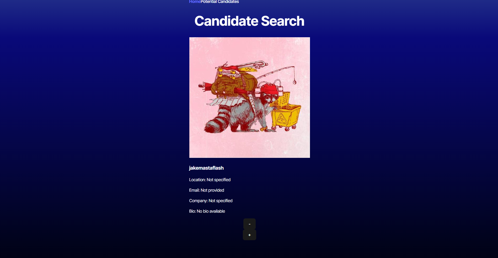
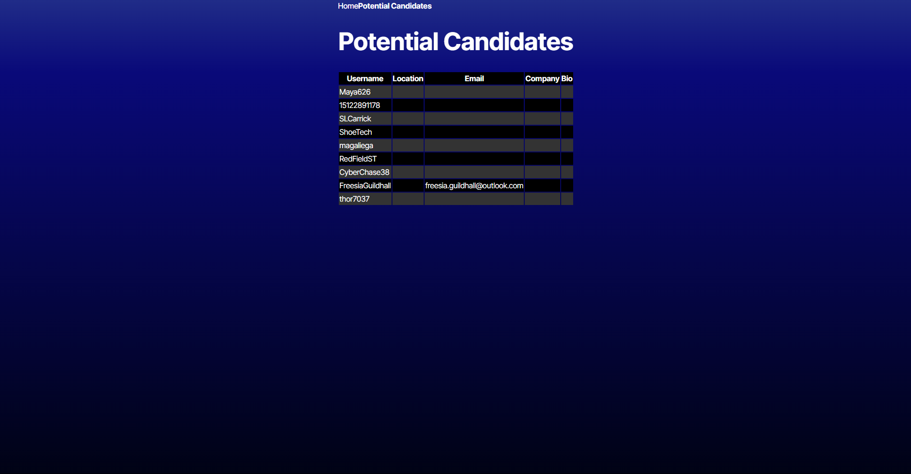

# Candidate Search

## Description
Candidate Search is a static web application hosted on render and is built with TypScript and React. It utilizes the GitHub API to render accounts that the user can choose as a potential candidate.

## Display

## Installation
N/A

## Usage
Once the app is open the user is met with the "Candidate Search" page which shows a GitHub account. The profile picture, username, location, email, company, and bio is shown along with two buttons. The "-" button goes to the next candidate without saving it to the "Potential Candidates" Page. The "+" button saves the profile and goes to the next candidate. When the user clicks on the Potential Candidates nav tab, the user is shown all the of saved candidates.

To view this application please follow this link:

https://candidate-search-ufo8.onrender.com/SavedCandidates

## Contributors
N/A

# Questions
GitHub: TalHol06 
Email: taleeh98454@gmail.com

## License
N/A